Задание:

запустить контейнер с БД, отличной от mariaDB, используя инструкции на сайте: https://hub.docker.com/
добавить в контейнер hostname такой же, как hostname системы через переменную
заполнить БД данными через консоль
запустить phpmyadmin (в контейнере) и через веб проверить, что все введенные данные доступны
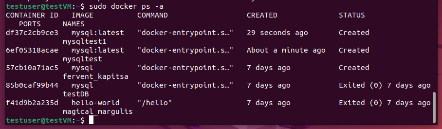
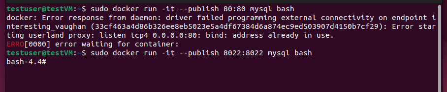
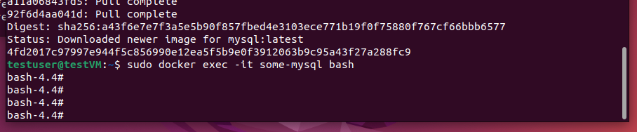
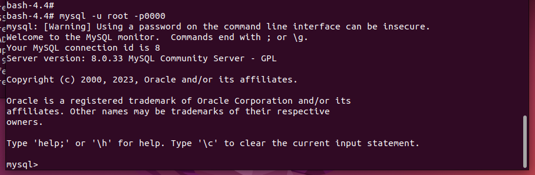
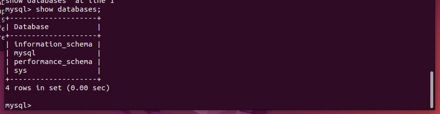
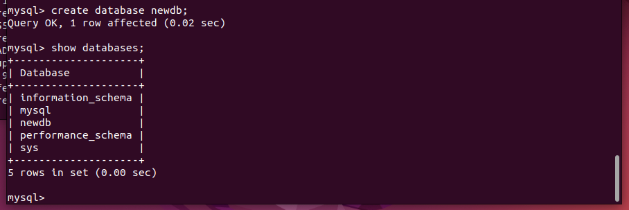
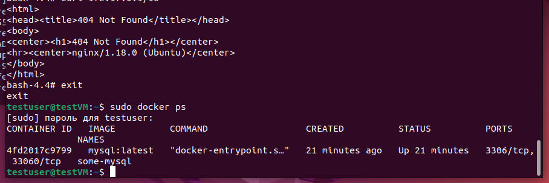
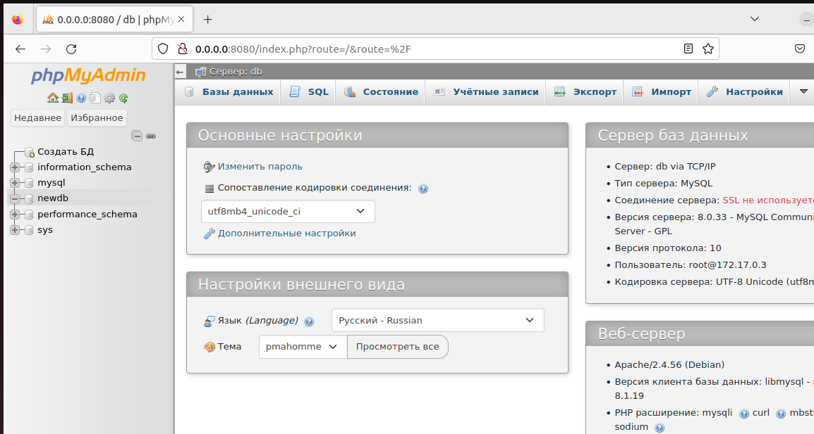
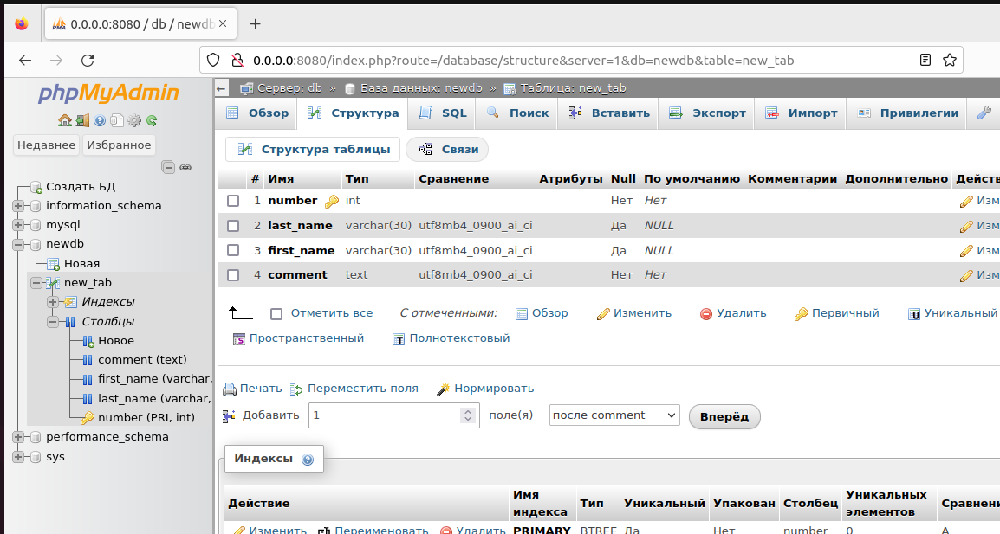
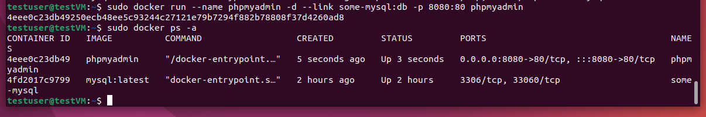
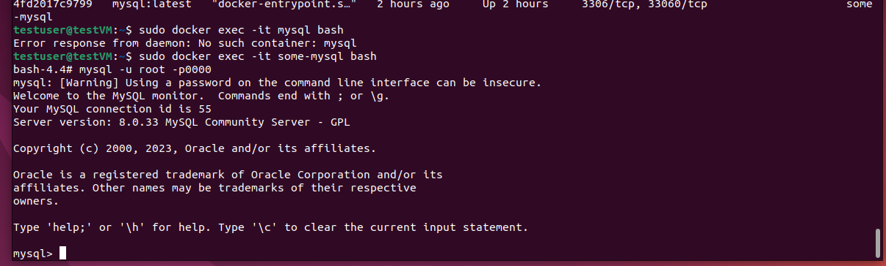
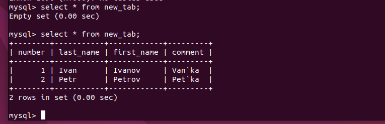
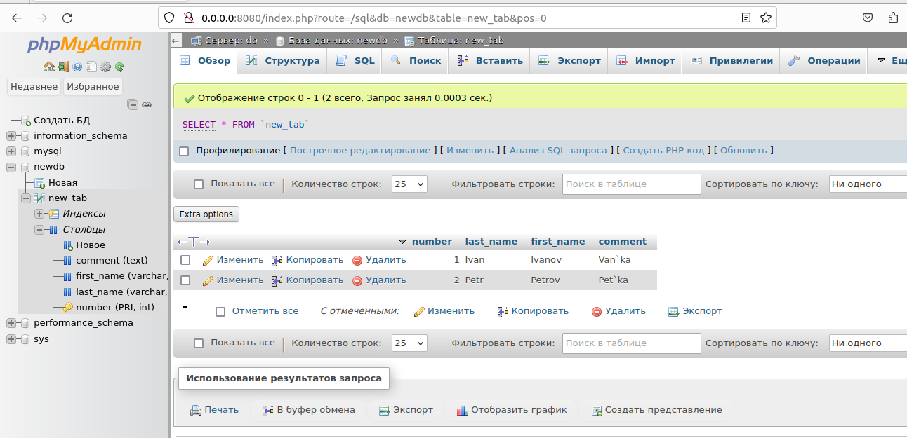

