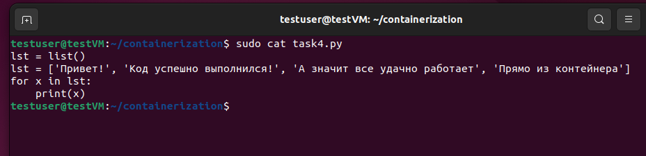
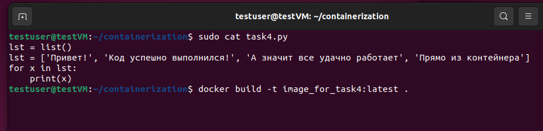
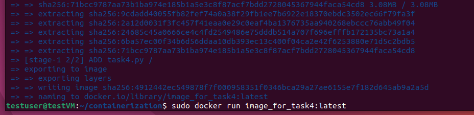
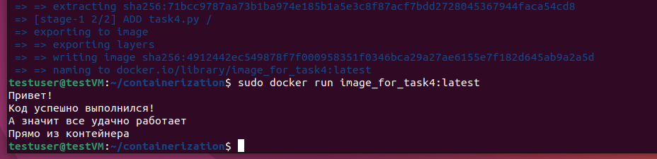

Информация о проекте
Задание: необходимо создать Dockerfile, основанный на любом образе (вы в праве выбрать самостоятельно). В него необходимо поместить приложение, написанное на любом известном вам языке программирования (Python, Java, C, С#, C++). При запуске контейнера должно запускаться самостоятельно написанное приложение.

Выполнение

