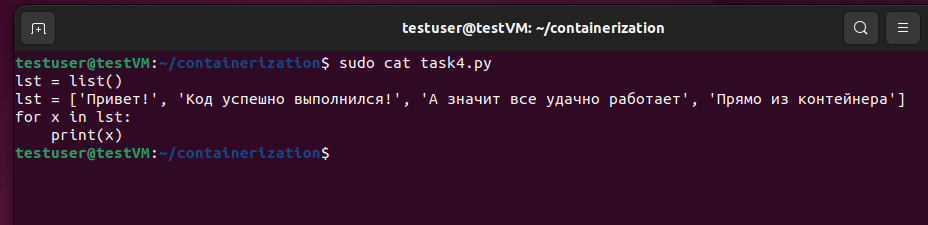
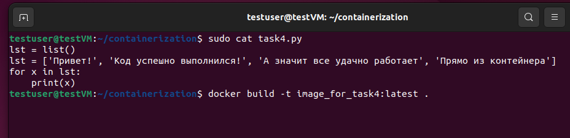
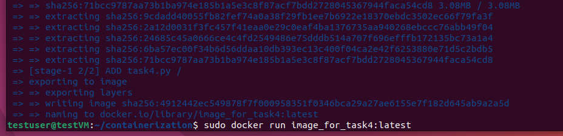

Задание 1:

создать сервис, состоящий из 2 различных контейнеров: 1 - веб, 2 - БД
далее необходимо создать 3 сервиса в каждом окружении (dev, prod, lab)
по итогу на каждой ноде должно быть по 2 работающих контейнера
выводы зафиксировать
Задание 2*:

нужно создать 2 ДК-файла, в которых будут описываться сервисы
повторить задание 1 для двух окружений: lab, dev
обязательно проверить и зафиксировать результаты, чтобы можно было выслать преподавателю для проверки
Задание со звездочкой - повышенной сложности, это нужно учесть при выполнении (но сделать его необходимо).

Формат сдачи ДЗ: предоставить доказательства выполнения задания посредством ссылки на google-документ с правами на комментирование/редактирование. Результатом работы будет: текст объяснения, логи выполнения, история команд и скриншоты (важно придерживаться такой последовательности). В названии работы должны быть указаны ФИ, номер группы и номер урока.

Критерии оценивания ПА “Контейнеризация”:

Выслан подробный отчет по выполнению 5-го ДЗ (см.: результаты работы)
Выполнено / частично выполнено / сделана попытка выполнения задания 2* в 5-м ДЗ.
Добавлена история выполнения команд в 5-м ДЗ. Идеально, если выслан весь процесс попыток выполнения, учитывая ошибочные.
В данном случае оценку НЕ снижать при некорректном выполнении задания со *. Снижать только в случае отсутствия попытки его выполнения. Оценивается “зачет”\”незачет” “зачет” проставляется при выполнении 3 критериев. “незачет” проставляется при выполнении 2 и менее критериев.

Выполнение

